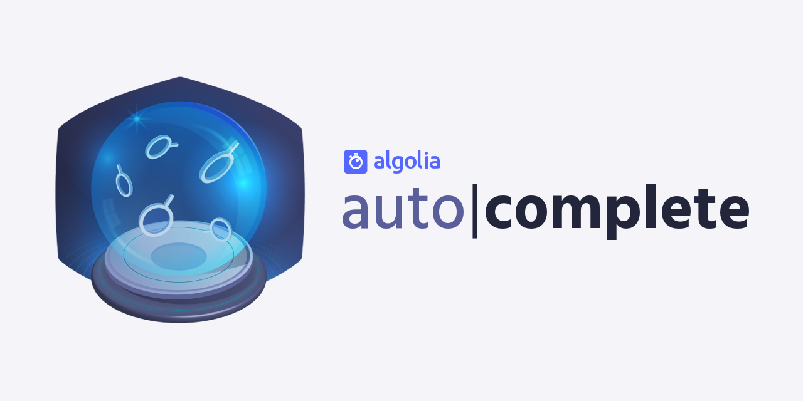
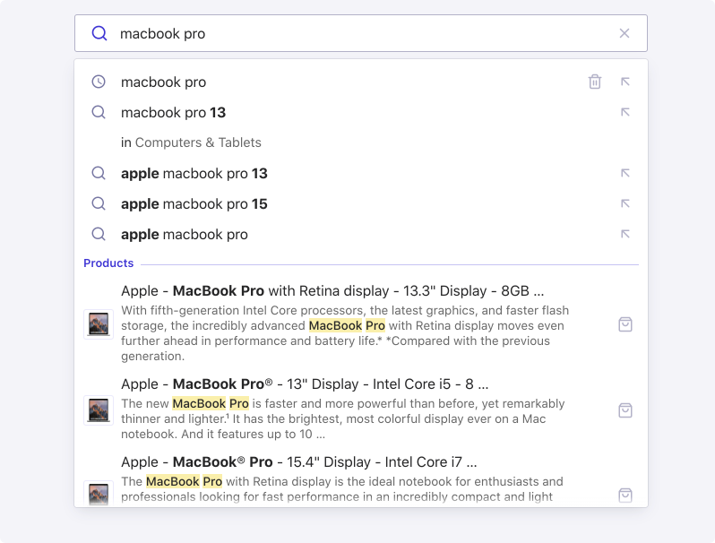
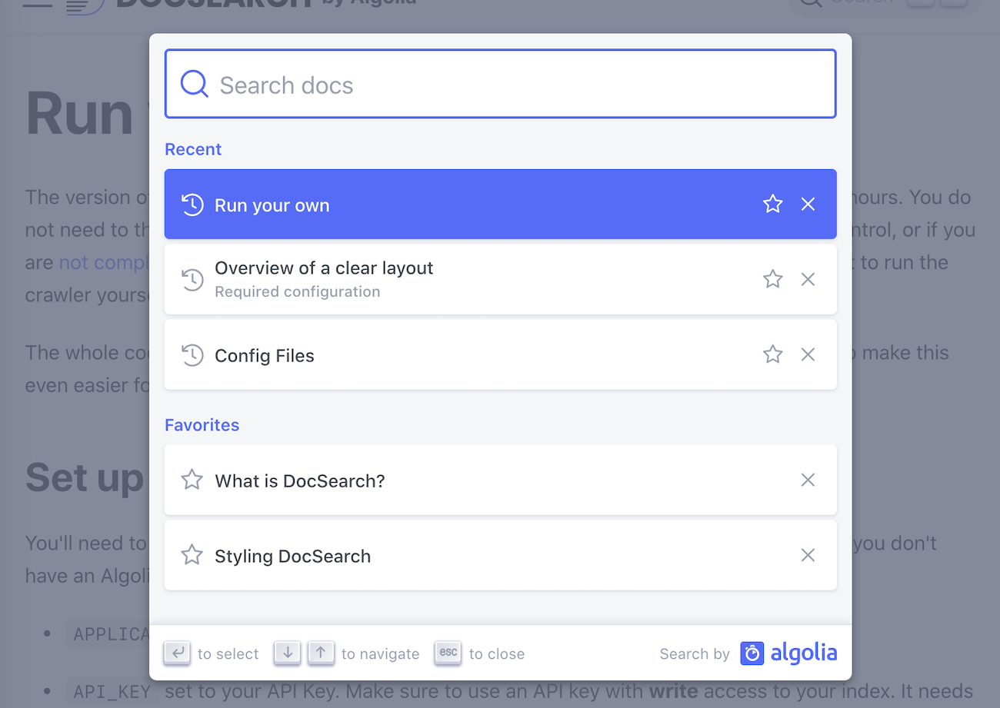
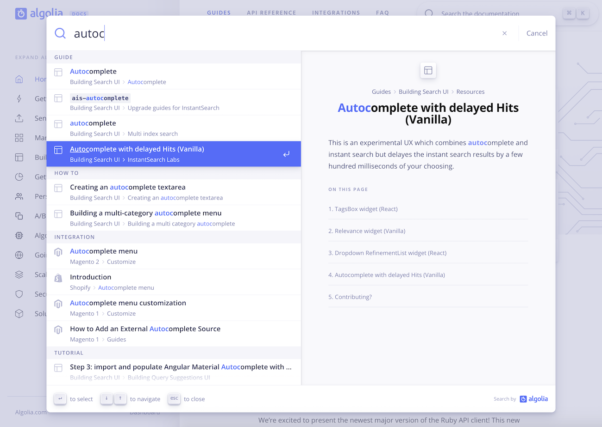

<div align="center">
	<a href="https://www.algolia.com/doc/ui-libraries/autocomplete/introduction/what-is-autocomplete"></a>
	<p>
		<strong>A JavaScript library that lets you quickly build autocomplete experiences</strong>
	</p>

[](https://www.npmjs.com/package/@algolia/autocomplete-js) [](LICENSE)

</div>

All you need to get started is:

- A container to inject the experience into
- Data to fill the autocomplete with
- Any Virtual DOM solution (JavaScript, Preact, React, Vue, etc.)

The data that populates the autocomplete results are called [sources](https://www.algolia.com/doc/ui-libraries/autocomplete/core-concepts/sources). You can use whatever you want in your sources: a static set of searches terms, search results from an external source like an [Algolia](https://www.algolia.com/doc/guides/getting-started/what-is-algolia/) index, recent searches, and more.

By configuring just those two required parameters ([`container`](https://www.algolia.com/doc/ui-libraries/autocomplete/api-reference/autocomplete-js/autocomplete/#param-container) and [`getSources`](https://www.algolia.com/doc/ui-libraries/autocomplete/api-reference/autocomplete-js/autocomplete/#param-getsources)) you can have an interactive autocomplete experience. **The library creates an input and provides the interactivity and accessibility attributes, but you're in full control of the DOM elements to output**.

<p align="center">
  <a href="https://codesandbox.io/s/github/algolia/autocomplete/tree/next/examples/playground?file=/app.tsx">
    
  </a>
  <br>
  <br>
  <strong>
  <a href="https://www.algolia.com/doc/ui-libraries/autocomplete/introduction/what-is-autocomplete">Documentation</a> •
  <a href="https://www.algolia.com/doc/ui-libraries/autocomplete/api-reference/autocomplete-js/autocomplete">API</a> •
  <a href="https://codesandbox.io/s/github/algolia/autocomplete/tree/next/examples/playground?file=/app.tsx">Playground</a>
  </strong>
</p>

## Installation

The recommended way to get started is with the [`autocomplete-js`](https://www.algolia.com/doc/ui-libraries/autocomplete/api-reference/autocomplete-js) package. It includes everything you need to render a JavaScript autocomplete experience.

Otherwise, you can install the [`autocomplete-core`](https://www.algolia.com/doc/ui-libraries/autocomplete/api-reference/autocomplete-core) package if you want to [build a renderer](https://www.algolia.com/doc/ui-libraries/autocomplete/guides/creating-a-renderer) from scratch.

All Autocomplete packages are available on the [npm](https://www.npmjs.com) registry.

```bash
yarn add @algolia/autocomplete-js
# or
npm install @algolia/autocomplete-js
```

If you don't use a package manager, you can use the HTML `script` element:

```html
<script src="https://cdn.jsdelivr.net/npm/@algolia/autocomplete-js"></script>
<script>
  const { autocomplete } = window['@algolia/autocomplete-js'];
</script>
```

## Usage

To get started, you need a container for your autocomplete to go in. If you don't have one already, you can insert one into your markup:

```js title="HTML"
<div id="autocomplete"></div>
```

Then, insert your autocomplete into it by calling the [`autocomplete`](https://www.algolia.com/doc/ui-libraries/autocomplete/api-reference/autocomplete-js/autocomplete/) function and providing the [`container`](https://www.algolia.com/doc/ui-libraries/autocomplete/api-reference/autocomplete-js/autocomplete/#param-container). It can be a [CSS selector](https://developer.mozilla.org/docs/Web/CSS/CSS_Selectors) or an [Element](https://developer.mozilla.org/docs/Web/API/HTMLElement).

Make sure to provide a container (e.g., a `div`), not an `input`. Autocomplete generates a fully accessible search box for you.

```js title="JavaScript"
import { autocomplete } from '@algolia/autocomplete-js';

autocomplete({
  container: '#autocomplete',
  // ...
});
```

Continue reading our [**Getting Started**](https://www.algolia.com/doc/ui-libraries/autocomplete/introduction/getting-started/#defining-where-to-put-your-autocomplete) guide.

## Documentation

The [documentation](https://www.algolia.com/doc/ui-libraries/autocomplete/introduction/what-is-autocomplete) offers a few ways to learn about the Autocomplete library:

- Read the [**Core Concepts**](https://www.algolia.com/doc/ui-libraries/autocomplete/core-concepts/basic-configuration-options/) to learn more about underlying principles, like [**Sources**](https://www.algolia.com/doc/ui-libraries/autocomplete/core-concepts/sources/) and [**State**](https://www.algolia.com/doc/ui-libraries/autocomplete/core-concepts/state/).
- Follow the [**Guides**](https://www.algolia.com/doc/ui-libraries/autocomplete/guides/adding-suggested-searches) to understand how to build common UX patterns.
- Refer to [**API reference**](https://www.algolia.com/doc/ui-libraries/autocomplete/api-reference/autocomplete-js) for a comprehensive list of parameters and options.
- Try out the [**Playground**](https://codesandbox.io/s/github/algolia/autocomplete/tree/next/examples/playground?file=/app.tsx) where you can fork a basic implementation and play around.

You can find more on the [documentation](https://www.algolia.com/doc/ui-libraries/autocomplete/introduction/what-is-autocomplete).

## Support

- [GitHub Discussions](https://github.com/algolia/autocomplete/discussions)

## Packages

| Package | Description | Documentation |
| --- | --- | --- |
| [`autocomplete-js`](packages/autocomplete-js) | JavaScript package for Autocomplete | [Documentation](https://www.algolia.com/doc/ui-libraries/autocomplete/api-reference/autocomplete-js) |
| [`autocomplete-core`](packages/autocomplete-core) | JavaScript core primitives to build an autocomplete experience | [Documentation](https://www.algolia.com/doc/ui-libraries/autocomplete/api-reference/autocomplete-core) |
| [`autocomplete-plugin-recent-searches`](packages/autocomplete-plugin-recent-searches) | A plugin to add recent searches to Autocomplete | [Documentation](https://www.algolia.com/doc/ui-libraries/autocomplete/api-reference/autocomplete-plugin-recent-searches) |
| [`autocomplete-plugin-query-suggestions`](packages/autocomplete-plugin-query-suggestions) | A plugin to add query suggestions to Autocomplete | [Documentation](https://www.algolia.com/doc/ui-libraries/autocomplete/api-reference/autocomplete-plugin-query-suggestions) |
| [`autocomplete-plugin-algolia-insights`](packages/autocomplete-plugin-algolia-insights) | A plugin to add Algolia Insights to Autocomplete | [Documentation](https://www.algolia.com/doc/ui-libraries/autocomplete/api-reference/autocomplete-plugin-algolia-insights) |
| [`autocomplete-plugin-redirect-url`](packages/autocomplete-plugin-redirect-url) | A plugin to enable redirect URLs | [Documentation](https://www.algolia.com/doc/ui-libraries/autocomplete/api-reference/autocomplete-plugin-redirect-url) |
| [`autocomplete-plugin-tags`](packages/autocomplete-plugin-tags) | A plugin to manage and display a list of tags in Autocomplete | [Documentation](https://www.algolia.com/doc/ui-libraries/autocomplete/api-reference/autocomplete-plugin-tags) |
| [`autocomplete-preset-algolia`](packages/autocomplete-preset-algolia) | Presets to use Algolia features with Autocomplete | [Documentation](https://www.algolia.com/doc/ui-libraries/autocomplete/api-reference/autocomplete-preset-algolia) |
| [`autocomplete-theme-classic`](packages/autocomplete-theme-classic) | Classic theme for Autocomplete | [Documentation](https://www.algolia.com/doc/ui-libraries/autocomplete/api-reference/autocomplete-theme-classic) |

## Showcase

See the awesome experiences people built with Autocomplete:

| [](https://docsearch.algolia.com) | [](https://algolia.com/doc) |
| --- | --- |
| <div align="center"><a href="https://docsearch.algolia.com">DocSearch</a></div> | <div align="center"><a href="https://algolia.com/doc">Algolia Documentation</a></div> |

Find more in our [**Showcase**](https://www.algolia.com/doc/ui-libraries/autocomplete/introduction/showcase/).

## Sandboxes

Check out [sandboxes using Autocomplete](https://www.algolia.com/doc/ui-libraries/autocomplete/introduction/sandboxes).

## License

[MIT](LICENSE)
