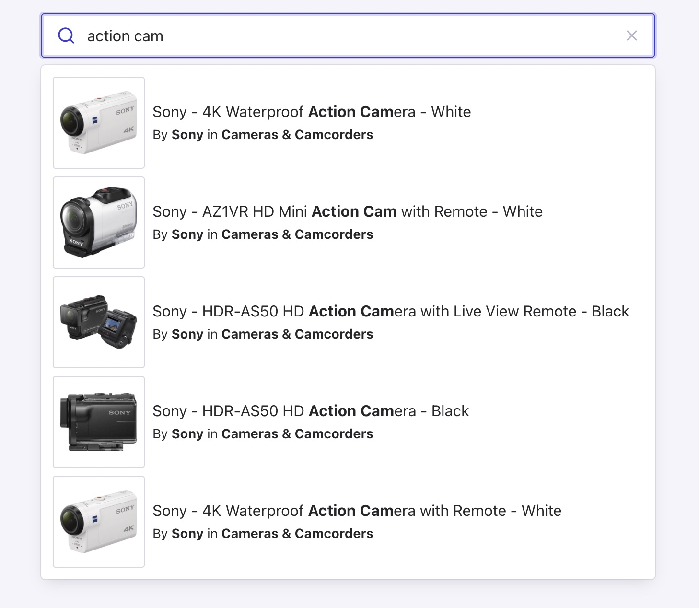

# Autocomplete starter with Algolia index

This example helps you quickly bootstrap a basic Autocomplete experience using Algolia.

<p align="center"></p>

## Demo

[Access the demo](https://codesandbox.io/s/github/algolia/autocomplete/tree/next/examples/starter-algolia)

## How to run this example locally

### 1. Clone this repository

```sh
git clone git@github.com:algolia/autocomplete.git
```

### 2. Install the dependencies and run the server

```sh
yarn
yarn workspace @algolia/autocomplete-example-starter-algolia start
```

Alternatively, you may use npm:

```sh
cd examples/starter-algolia
npm install
npm start
```

Open <http://localhost:1234> to see your app.

## Additional resources
Learn more [how to get started with Autocomplete](https://www.algolia.com/doc/ui-libraries/autocomplete/introduction/getting-started/) in the Algolia documentation.

